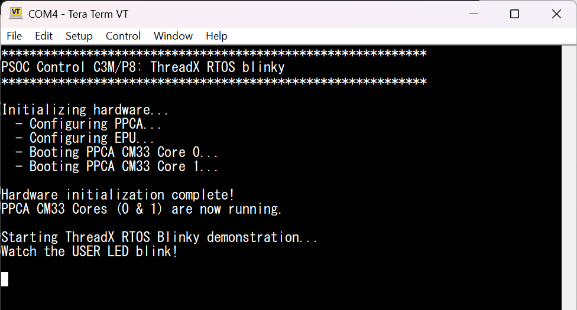

# PSOC&trade; Control C3M/P8: ThreadX RTOS blinky

This code example demonstrates a blinking LED application using **ThreadX v6.4.2** ([eclipse-threadx/threadx](https://github.com/eclipse-threadx/threadx)) running on the PSOC&trade; Control C3M/P8 MCU. ThreadX is ported and compiled directly as source alongside the application. The example also serves as a practical porting reference: it shows precisely which components of the upstream ThreadX repository are included, which are omitted, and the adaptation required to run ThreadX on the PSOC&trade; Control C3M/P8 MCU within the ModusToolbox&trade;.

[View this README on GitHub.](https://github.com/Infineon/mtb-example-ce242650-threadx-demo)

[Provide feedback on this code example.](https://yourvoice.infineon.com/jfe/form/SV_1NTns53sK2yiljn?Q_EED=eyJVbmlxdWUgRG9jIElkIjoiQ0UyNDI2NTAiLCJTcGVjIE51bWJlciI6IjAwMi00MjY1MCIsIkRvYyBUaXRsZSI6IlBTT0MmdHJhZGU7IENvbnRyb2wgQzNNL1A4OiBUaHJlYWRYIFJUT1MgYmxpbmt5IiwicmlkIjoiZGVlcGFrLnNoYXJtYUBpbmZpbmVvbi5jb20iLCJEb2MgdmVyc2lvbiI6IjEuMC4wIiwiRG9jIExhbmd1YWdlIjoiRW5nbGlzaCIsIkRvYyBEaXZpc2lvbiI6Ik1DRCIsIkRvYyBCVSI6IklDVyIsIkRvYyBGYW1pbHkiOiJQU09DIn0=)

## Requirements

- [ModusToolbox&trade;](https://www.infineon.com/modustoolbox) v3.9.0 or later (tested with v3.9.0)
- Board support package (BSP) minimum required version for:
   - KIT_PSC3M8_EVK: v2.2.0
- Programming language: C
- Associated parts: All [PSOC&trade; Control C3M/P8 MCU](https://www.infineon.com/products/microcontroller/32-bit-psoc-arm-cortex/32-bit-psoc-control-arm-cortex-m33-mcu/psoc-control-c3-performance-line) parts


## Supported toolchains (make variable 'TOOLCHAIN')

- GNU Arm&reg; Embedded Compiler v14.2.1 (`GCC_ARM`) – Default value of `TOOLCHAIN`
- Arm&reg; Compiler v6.22 (`ARM`)
- IAR C/C++ Compiler v9.70.4 (`IAR`)


## Supported kits (make variable 'TARGET')

- [PSOC&trade; Control C3M8 Evaluation Kit](https://www.infineon.com/KIT_PSC3M8_EVK) (`KIT_PSC3M8_EVK`) – Default value of `TARGET`


## Hardware setup

This code example targets the PSOC&trade; Control C3M/P8 MCU evaluation board (`KIT_PSC3M8_EVK`).

- Connect the board to the PC via the USB cable on the KitProg3 connector
- No external hardware or jumper changes are required; the onboard USER LED is used for the blinky output
- A serial terminal (e.g., Tera Term) is needed to observe the boot status messages printed over the KitProg3 virtual COM port (115200 baud, 8N1)

> **Note:** The PSOC&trade; Control C3M/P8 MCU used in this example has three Cortex-M33 cores:
> - **CM33_S (main_cm33_s)** – Secure core; runs the ThreadX RTOS kernel, LED blink logic, and boots the two PPCA sub-cores.
> - **PPCA CM33 Core 0 (ppca_cm33_0)** – PPCA core 0; started by the secure core during boot.
> - **PPCA CM33 Core 1 (ppca_cm33_1)** – PPCA core 1; started by the secure core during boot.


## Software setup

See the [ModusToolbox&trade; tools package installation guide](https://www.infineon.com/ModusToolboxInstallguide) for information about installing and configuring the tools package.

Install a terminal emulator if you do not have one. Instructions in this document use [Tera Term](https://teratermproject.github.io/index-en.html).

This example requires no additional software or tools other than a serial terminal emulator.


## ThreadX RTOS porting overview

This section is a step-by-step porting guide. It explains, at the folder/file level, how the vanilla (upstream) [eclipse-threadx/threadx](https://github.com/eclipse-threadx/threadx) **v6.4.2** repository was reorganized, renamed, and adapted to compile within the ModusToolbox&trade; build system for the PSOC&trade; Control C3M/P8 MCU (Cortex&reg;-M33 secure core).


### 1. Vanilla ThreadX repository structure

The upstream GitHub repository has the following top-level layout:

**Figure 1. Vanilla ThreadX repository structure**

```
threadx/                             ← GitHub root
├── common/                          # Portable kernel C source + headers
│   ├── inc/                         #   Public API headers (tx_api.h, tx_thread.h, ...)
│   └── src/                         #   ~160 portable C kernel sources
├── common_smp/                      # SMP kernel variant (multi-core scheduling)
│   ├── inc/
│   └── src/
├── ports/                           # Single-core, architecture-specific ports
│   ├── cortex_m33/
│   │   ├── gnu/                     #   GCC port (ASM: .S files)
│   │   │   ├── inc/                 #     tx_port.h, tx_secure_interface.h
│   │   │   └── src/                 #     Assembly sources (.S)
│   │   ├── ac6/                     #   Arm Compiler 6 port (ASM: .S files)
│   │   │   ├── inc/
│   │   │   └── src/
│   │   └── iar/                     #   IAR port (ASM: .s files; also has tx_iar.c)
│   │       ├── inc/
│   │       └── src/
│   └── ... (cortex_m4, cortex_a9, rx, etc.)
├── ports_smp/                       # SMP architecture ports
├── docs/                            # User guides, porting guides, PDFs
├── tx_user_sample.h                 # Template tx_user.h for customization
└── LICENSE.txt
```


### 2. What is included and excluded

This code example targets **one Cortex-M33 core in secure mode** (no SMP, no Non-Secure world). The following table summarizes what was taken from the upstream repository:

**Table 1. Summary of included and excluded components from the upstream ThreadX repository**

| Upstream folder/file | Included? | Reason |
|---|---|---|
| `common/inc/` | **Yes** – copied as-is | Portable public API headers; no changes required |
| `common/src/` | **Yes** – copied as-is | ~160 portable C kernel files; no changes required |
| `common_smp/` | **No** – excluded entirely | SMP scheduler not needed; only one ThreadX instance on one core |
| `ports/cortex_m33/gnu/` | **Yes** – reorganized and adapted | GCC CM33 assembly port; only `tx_initialize_low_level.S` is modified (see Section 5) |
| `ports/cortex_m33/ac6/` | **Yes** – reorganized and adapted | Arm Compiler 6 CM33 assembly port; only `tx_initialize_low_level.S` is modified (see Section 5) |
| `ports/cortex_m33/iar/` | **Yes** – reorganized and adapted | IAR CM33 assembly port; only `tx_initialize_low_level.s` is modified (see Section 5) |
| `ports_smp/` | **No** – excluded entirely | SMP port not applicable |
| `docs/` | **No** – excluded | Reference documentation; shipped separately |
| `tx_user_sample.h` | **No** – replaced | A project-specific `tx_user.h` is placed in the application `src/` folder instead |


### 3. Directory and file renaming conventions

The ModusToolbox&trade; build system uses a **naming convention** to auto-select source folders based on the current `COMPONENTS` and `TOOLCHAIN` make variables. The upstream ThreadX directory names must be mapped to this convention.

#### 3a. Folder renaming – ports

**Table 2. Folder renaming required to match ModusToolbox&trade; COMPONENT and TOOLCHAIN conventions**

| Upstream path | Ported path (under `main_cm33_s/src/threadx_rtos/`) | Why renamed |
|---|---|---|
| `ports/cortex_m33/` | `ports/COMPONENT_CM33/` | MTB auto-includes `COMPONENT_<name>` folders when `COMPONENTS+=CM33` is set in the BSP Makefile. The BSP provides this define for Cortex-M33 cores |
| `ports/cortex_m33/gnu/` | `ports/COMPONENT_CM33/TOOLCHAIN_GCC_ARM/` | MTB auto-includes `TOOLCHAIN_<name>` folders matching the active `TOOLCHAIN` make variable. `GCC_ARM` is the MTB name for the GNU Arm toolchain |
| `ports/cortex_m33/ac6/` | `ports/COMPONENT_CM33/TOOLCHAIN_ARM/` | `ARM` is the MTB name for Arm Compiler 6 (upstream calls it `ac6`) |
| `ports/cortex_m33/iar/` | `ports/COMPONENT_CM33/TOOLCHAIN_IAR/` | `IAR` is the MTB name for the IAR toolchain (upstream simply calls it `iar`) |

When the user runs `make build TOOLCHAIN=GCC_ARM`, the build system includes:
- All files under `COMPONENT_CM33/` (because `CM33` is in `COMPONENTS`)
- Only the `TOOLCHAIN_GCC_ARM/` sub-folder (matching the active toolchain)
- Skips `TOOLCHAIN_ARM/` and `TOOLCHAIN_IAR/` automatically

This means **all three toolchain ports coexist** in the source tree, but only the active one compiles.

#### 3b. Assembly file extension differences

**Table 3. Assembly file extension differences**

| Toolchain | Upstream ASM extension | Ported ASM extension | Notes |
|---|---|---|---|
| GCC_ARM (`gnu`) | `.S` (uppercase) | `.S` (unchanged) | GCC requires uppercase `.S` for the C preprocessor to run first (`#include`, `#ifdef`, etc.) |
| ARM (`ac6`) | `.S` (uppercase) | `.S` (unchanged) | Arm Compiler 6 also uses uppercase `.S` |
| IAR (`iar`) | `.s` (lowercase) | `.s` (unchanged) | IAR's assembler (`iasmarm`) uses lowercase `.s`; it has its own preprocessor directives |

> **Key takeaway:** No assembly file extensions were changed. The extensions match what each toolchain expects natively.

#### 3c. Extra toolchain-specific source files

**Table 4. Additional toolchain‑specific ThreadX source files included in the port**

| File | Toolchain | Description |
|---|---|---|
| `tx_iar.c` | IAR only | IAR multi-threaded C library support (`__iar_system_Mtxinit`, `DLib_Threads.h`). Present only in `TOOLCHAIN_IAR/src/`. Not needed by GCC or Arm Compiler 6 |
| `txe_thread_secure_stack_allocate.c` | All | Error-checking wrapper for `_tx_thread_secure_stack_allocate()` |
| `txe_thread_secure_stack_free.c` | All | Error-checking wrapper for `_tx_thread_secure_stack_free()` |
| `tx_thread_secure_stack.c` | All | C implementation of TrustZone secure stack management |

#### 3d. The `common/` folder

Copied **unchanged** from the upstream `common/` directory. Both `inc/` and `src/` sub-folders have identical file lists. This includes the `tx_user_sample.h` template in `inc/`, though it is **not** used directly – the project uses a separate `tx_user.h` (see Section 4).

#### 3e. Summary mapping diagram

**Figure 2. Summary mapping diagram**

```
Upstream ThreadX                                  This MTB Project
─────────────────                                 ───────────────────────────────────────────────
threadx/                                          main_cm33_s/src/threadx_rtos/
├── common/                              →        ├── common/                    (copied as-is)
│   ├── inc/    (tx_api.h, ...)          →        │   ├── inc/
│   └── src/    (~160 .c files)          →        │   └── src/
├── common_smp/                          ✗        │   (excluded – not needed for single-core)
├── ports/                               →        ├── ports/
│   └── cortex_m33/                      →        │   └── COMPONENT_CM33/        (renamed)
│       ├── gnu/                         →        │       ├── TOOLCHAIN_GCC_ARM/  (renamed)
│       │   ├── inc/  (tx_port.h)        →        │       │   ├── inc/
│       │   └── src/  (*.S files)        →        │       │   └── src/            (adapted)
│       ├── ac6/                         →        │       ├── TOOLCHAIN_ARM/      (renamed)
│       │   ├── inc/                     →        │       │   ├── inc/
│       │   └── src/                     →        │       │   └── src/            (adapted)
│       └── iar/                         →        │       └── TOOLCHAIN_IAR/      (renamed)
│           ├── inc/                     →        │           ├── inc/
│           └── src/  (*.s + tx_iar.c)   →        │           └── src/            (adapted)
├── ports_smp/                           ✗        │   (excluded – SMP not needed)
├── docs/                                ✗        ├── docs/                       (only README.md kept)
└── tx_user_sample.h                     →        (replaced by src/tx_user.h outside threadx_rtos/)
```


### 4. `tx_user.h` – placement and configuration

In the upstream ThreadX, `tx_user_sample.h` serves as a template. The user is expected to copy it, rename it to `tx_user.h`, and place it in an include path. The ThreadX port header `tx_port.h` conditionally includes `tx_user.h` when `TX_INCLUDE_USER_DEFINE_FILE` is defined.

In this project, `tx_user.h` is placed **outside** the `threadx_rtos/` directory, at:

```
main_cm33_s/src/tx_user.h        ← application-level configuration
```

This keeps the upstream `threadx_rtos/` tree clean and unmodified (except for the port assembly adaptations). The MTB build system adds `main_cm33_s/src/` to the include path automatically.

Key defines in `tx_user.h`:

```c
/* Run ThreadX entirely in Secure mode (no Non-Secure hand-off) */
#define TX_SINGLE_MODE_SECURE

/* Use BASEPRI register for interrupt masking instead of PRIMASK.
 * Allows ISRs at priority 0–3 to remain unmasked during ThreadX critical sections. */
#define TX_PORT_USE_BASEPRI
#define TX_PORT_ISR_SAFE_PRIORITY   4
#define TX_PORT_BASEPRI             (TX_PORT_ISR_SAFE_PRIORITY << (8 - 3))

/* Skip redundant BSS zeroing (already done by C startup) */
#define TX_DISABLE_REDUNDANT_CLEARING

/* Thread priority levels */
#define TX_MAX_PRIORITIES           32

/* SysTick tick rate: 1 ms per tick → 1000 ticks/second */
#define TX_TIMER_TICKS_PER_SECOND   1000
```


### 5. IFX-specific adaptations in the assembly port

Among all the assembly and C source files in each toolchain's `src/` directory (~17 files per toolchain), **only one file requires adaptation for the PSOC&trade; Control C3M/P8 MCU and ModusToolbox&trade;: `tx_initialize_low_level.S` (`.s` for IAR).** All other assembly and C source files in the port `src/` directories (e.g., `tx_thread_schedule.S`, `tx_thread_context_save.S`, `tx_thread_context_restore.S`, `tx_timer_interrupt.S`, etc.) are **direct, unmodified copies** from the upstream ThreadX v6.4.2 repository.

Every IFX modification in `tx_initialize_low_level.S/.s` is marked with `/* IFX: ... */` comments. Original upstream code is preserved as commented-out lines (prefixed with `@` for GCC/ARM or `//` for IAR) so users can compare the original vs. adapted code directly.

**5a. Changes in `tx_initialize_low_level` (all toolchains)**

**Table 5. Changes in tx_initialize_low_level (all toolchains)**

| Area | Upstream (vanilla) | IFX adaptation | Reason |
|---|---|---|---|
| **VTOR setup** | Writes `__Vectors` (or `__vector_table`) to `SCB->VTOR` | **Removed** – left as a comment | `cybsp_init()` sets VTOR before `tx_kernel_enter()` in ModusToolbox projects |
| **Stack/heap defines** | Hardcoded `STACK_SIZE`, `HEAP_SIZE` as assembly constants | **Removed** – left as a comment | Memory layout is defined by the MTB linker script, not by ThreadX |
| **First-free memory** | Computes `_tx_initialize_unused_memory` from linker symbol `__RAM_segment_used_end__` | **Removed** – left as a comment | Project uses static byte pools instead of passing free RAM to `tx_application_define()` |
| **SysTick reload** | Hardcoded: `SYSTICK_CYCLES = (SYSTEM_CLOCK / 100) - 1` | **Dynamic**: loads `SystemCoreClock` at runtime, divides by `TX_TIMER_TICKS_PER_SECOND` | Works automatically with any clock configuration; no manual constant update needed |
| **System stack pointer** | Loaded from `__Vectors` symbol | Loaded from `SCB->VTOR` register (`0xE000ED08`) | In MTB, the vector table symbol may differ (`__Vectors` vs `__vector_table`); reading VTOR directly is toolchain-agnostic |
| **Handler (exception) priorities** | PendSV = `0xFF` (lowest), SysTick = `0x40`, SVC = `0xFF` | PendSV = `0xE0` (priority 7), SysTick = `0xC0` (priority 6), SVC = `0x20` (priority 1) | Tuned for `TX_PORT_USE_BASEPRI` with `TX_PORT_ISR_SAFE_PRIORITY=4`. PendSV/SysTick must be below the BASEPRI threshold so ThreadX can mask them; SVC must be above it |
| **HardFault_Handler** | Defined as a global symbol (infinite loop) | **Removed** – commented out | The BSP already provides `HardFault_Handler` in `startup_cat1b_cm33.c`; defining it again would cause a duplicate-symbol linker error |

**5b. IAR-specific: secure-stack weak stubs**

When building with IAR and `TX_SINGLE_MODE_SECURE`, the TrustZone secure-stack allocation functions referenced by the CM33 port are unused. Weak stubs are provided in `app_threadx.c` (application code, not in the port):

```c
#pragma weak _tx_thread_secure_mode_stack_allocate
UINT _tx_thread_secure_mode_stack_allocate(TX_THREAD *thread_ptr, ULONG stack_size)
{ return TX_FEATURE_NOT_ENABLED; }
// ... similar stubs for _free, _initialize, _context_save, _context_restore
```

These prevent linker errors without modifying any files inside `threadx_rtos/`.


**5c. Exception handler re-registration (BSP weak → ThreadX strong)**

The BSP startup file (`bsps/TARGET_APP_KIT_PSC3M8_EVK/startup_cat1b_cm33.c`) declares ARM Cortex-M exception handlers—including `SysTick_Handler`, `PendSV_Handler`, and `SVC_Handler`—as **weak symbols** aliased to default handlers:

```c
/* In startup_cat1b_cm33.c */
void SVC_Handler      (void) __attribute__ ((weak, alias("HardFault_Handler")));
void PendSV_Handler   (void) __attribute__ ((weak, alias("Default_Handler")));
void SysTick_Handler  (void) __attribute__ ((weak, alias("Default_Handler")));
```

The BSP vector table (`__Vectors[]`) references these symbols at their standard Cortex-M positions. Because they are declared `weak`, the linker replaces them with any **strong** (`.global`) definition found elsewhere.

ThreadX re-defines these three handlers in its port assembly files:

**Table 6. Exception handlers redefined by ThreadX in its Cortex‑M33 port assembly files** 

| Handler | Defined in | File modified? | Routes to | Purpose |
|---|---|---|---|---|
| `SysTick_Handler` | `tx_initialize_low_level.S/.s` | **Yes** – IFX-adapted | `_tx_timer_interrupt` | ThreadX kernel tick; drives `tx_thread_sleep()`, timers, time-slicing |
| `PendSV_Handler` | `tx_thread_schedule.S/.s` | No – upstream copy | ThreadX context-switch logic | Performs thread context save/restore during scheduling |
| `SVC_Handler` | `tx_thread_schedule.S/.s` | No – upstream copy | ThreadX first-thread launch | Used to start the very first thread from privileged mode |
| `UsageFault_Handler` | `tx_initialize_low_level.S/.s` | No – upstream code | ThreadX stack-overflow detector | Checks for stack limit faults, calls `_tx_thread_stack_error_handler`, triggers PendSV for recovery |

**How the override works at link time:**

1. The BSP compiles `startup_cat1b_cm33.c` → produces **weak** `SysTick_Handler`, `PendSV_Handler`, `SVC_Handler` symbols
2. The ThreadX port compiles `tx_initialize_low_level.S` and `tx_thread_schedule.S` → produces **strong** (`.global`) symbols with the same names.
3. At **link time**, the linker resolves the vector table entries to the **strong** ThreadX definitions (weak symbols are discarded)
4. At **runtime**, when SysTick fires, the CPU vectors into ThreadX's `SysTick_Handler`, which calls `_tx_timer_interrupt` to advance the kernel tick. Similarly, `PendSV_Handler` performs context switching between threads

> **No runtime re-registration or code patching is needed.** The `weak`-attribute / `.global`-symbol mechanism is resolved entirely at link time. The BSP vector table automatically points to the ThreadX handlers without any code changes to the BSP startup file.

> **Note:** `PendSV_Handler` and `SVC_Handler` come from `tx_thread_schedule.S`, which is an **unmodified copy** from the upstream ThreadX repository. Only `SysTick_Handler` resides in `tx_initialize_low_level.S` — the single IFX-adapted file.


### 6. Application-level files (outside `threadx_rtos/`)

These files form the application code that uses ThreadX. They are **not** part of the upstream ThreadX source and are specific to this code example:

**Table 7. Application‑level files**

| File | Purpose |
|---|---|
| `main_cm33_s/src/main.c` | System entry point; calls `cybsp_init()`, `__enable_irq()`, then `tx_kernel_enter()` |
| `main_cm33_s/src/app_threadx.c` | Implements `tx_application_define()` and `App_ThreadX_Init()` – creates all RTOS objects |
| `main_cm33_s/src/app_threadx.h` | Shared macros (stack sizes, priorities, tick period), extern declarations for all RTOS objects |
| `main_cm33_s/src/thread_led.c` | Blinky + main-task thread entry functions; global RTOS object definitions |
| `main_cm33_s/src/thread_main.c` | Boot thread entry – UART init, PPCA core boot, priority demotion |
| `main_cm33_s/src/tx_user.h` | ThreadX kernel configuration (see Section 4) |

**Memory management approach:**

The upstream ThreadX port passes a `first_unused_memory` pointer to `tx_application_define()`. This project ignores that pointer and instead uses **statically allocated byte arrays** for thread stacks and the byte pool:

```c
UCHAR thread_blinky_stack[THREAD_STACK_SIZE]      __attribute__((aligned(8)));
UCHAR byte_pool_buffer[TX_APP_MEM_POOL_SIZE]       __attribute__((aligned(8)));
```

This decouples ThreadX from the linker script memory map and matches the standard ModusToolbox&trade; project convention.


### 7. Calling sequence from reset to RTOS

```
Reset vector
    └─> C runtime startup (crt0) – zero BSS, copy data, init FPU
            └─> main()
                    ├─> cybsp_init()          // BSP: clocks, GPIO, VTOR, SysTick (pre-RTOS)
                    ├─> __enable_irq()        // Allow exceptions before kernel starts
                    └─> tx_kernel_enter()     // Hand off to ThreadX
                            ├─> _tx_initialize_low_level()    // IFX ASM: SysTick, handler priorities
                            ├─> _tx_initialize_high_level()   // Portable C: internal object init
                            ├─> tx_application_define()       // App callback: create RTOS objects
                            │       ├─> tx_byte_pool_create()
                            │       ├─> tx_semaphore_create()
                            │       ├─> tx_thread_create() × 3  // blinky, main_task, main_boot
                            └─> Scheduler starts → highest-priority ready thread runs
```


### 8. Porting checklist

To port this ThreadX integration to MCU:

1. **Copy `threadx_rtos/`** into your project's source folder
2. **Rename the port `COMPONENT_` folder** to match your core (e.g., `COMPONENT_CM4` for a Cortex-M4 target) and ensure the BSP adds the matching `COMPONENTS+=CM4`
3. **Select the correct upstream port.** For CM4, use `ports/cortex_m4/gnu/`, `ac6/`, `iar/` from the ThreadX repository and apply the same folder renaming (`TOOLCHAIN_GCC_ARM`, `TOOLCHAIN_ARM`, `TOOLCHAIN_IAR`)
4. **Adapt `tx_initialize_low_level.S`** in each toolchain folder:
   - Remove or comment out VTOR setup (done by `cybsp_init()`)
   - Remove or comment out `_tx_initialize_unused_memory` computation (use static pools)
   - Replace hardcoded SysTick reload with `SystemCoreClock / TX_TIMER_TICKS_PER_SECOND`.
   - Adjust PendSV/SysTick/SVC priorities to match your BASEPRI configuration
5. **Create `tx_user.h`** in your application source folder with the desired kernel settings (`TX_SINGLE_MODE_SECURE` or `TX_SINGLE_MODE_NON_SECURE`, `TX_PORT_USE_BASEPRI`, `TX_MAX_PRIORITIES`, etc.)
6. **Write application code** (`tx_application_define`, thread entries, etc.) following the pattern shown in this code example


### 9. IDE-specific configuration

#### Keil µVision – Assembler selection

After creating the Keil µVision project, configure the following additional setting to ensure the build completes successfully. The project contains a mix of GNU-syntax assembly (ThreadX `.S` files, requiring armclang) and legacy armasm syntax (some PDL `.s` files). Without this setting, ThreadX assembly files fail with "Unknown opcode" errors.

**Required:** **Project → Options for Target → Asm → Assembler Selection → `armclang (Auto Select)`**

This lets the IDE automatically use armclang for `.S` files and armasm for `.s` files.

#### IAR EWARM – Library configuration for ThreadX

After creating the IAR EWARM project, configure the following setting for the `main_cm33_s` project to ensure the build completes successfully. ThreadX requires the **Full** DLib configuration to expose `DLib_threads.h` (included by `tx_iar.c` for multi-threaded C library support). Without this setting, the IAR compiler fails with the error *"Option --dlib_config does not match previous occurrence"* because `--dlib_config` would be specified twice.

**Required: Step-1** **Project → Options → General Options → Library Configuration → Library → `Full`**

Also check **Enable thread support in library** on the same page.

**Required: Step-2** Ensure that **Project → Options → C/C++ Compiler → Extra Options** does **not** contain `--dlib_config=full`.


## Using the code example


### Create the project

The ModusToolbox&trade; tools package provides the Project Creator as both a GUI tool and a command line tool.

<details><summary><b>Use Project Creator GUI</b></summary>

1. Open the Project Creator GUI tool

   There are several ways to do this, including launching it from the dashboard or from inside the Eclipse IDE. For more details, see the [Project Creator user guide](https://www.infineon.com/ModusToolboxProjectCreator) (locally available at *{ModusToolbox&trade; install directory}/tools_{version}/project-creator/docs/project-creator.pdf*)

2. On the **Choose Board Support Package (BSP)** page, select a kit supported by this code example. See [Supported kits](#supported-kits-make-variable-target)

   > **Note:** To use this code example for a kit not listed here, you may need to update the source files. If the kit does not have the required resources, the application may not work

3. On the **Select Application** page:

   a. Select the **Applications(s) Root Path** and the **Target IDE**

      > **Note:** Depending on how you open the Project Creator tool, these fields may be pre-selected for you

   b. Select this code example from the list by enabling its check box

      > **Note:** You can narrow the list of displayed examples by typing in the filter box

   c. (Optional) Change the suggested **New Application Name** and **New BSP Name**

   d. Click **Create** to complete the application creation process

</details>


<details><summary><b>Use Project Creator CLI</b></summary>

The 'project-creator-cli' tool can be used to create applications from a CLI terminal or from within batch files or shell scripts. This tool is available in the *{ModusToolbox&trade; install directory}/tools_{version}/project-creator/* directory.

Use a CLI terminal to invoke the 'project-creator-cli' tool. On Windows, use the command-line 'modus-shell' program provided in the ModusToolbox&trade; installation instead of a standard Windows command-line application. This shell provides access to all ModusToolbox&trade; tools. You can access it by typing "modus-shell" in the search box in the Windows menu. In Linux and macOS, you can use any terminal application.

The following example clones the "[mtb-example-ce242650-threadx-demo](https://github.com/Infineon/mtb-example-ce242650-threadx-demo)" application with the desired name "MulticoreBlinky" configured for the *KIT_PSC3M8_EVK* BSP into the specified working directory, *C:/mtb_projects*:

   ```
   project-creator-cli --board-id KIT_PSC3M8_EVK --app-id mtb-example-ce242650-threadx-demo --user-app-name TheadX_RTOS --target-dir "C:/mtb_projects"
   ```

The 'project-creator-cli' tool has the following arguments:

Argument | Description | Required/optional
---------|-------------|-----------
`--board-id` | Defined in the <id> field of the [BSP](https://github.com/Infineon?q=bsp-manifest&type=&language=&sort=) manifest | Required
`--app-id`   | Defined in the <id> field of the [CE](https://github.com/Infineon?q=ce-manifest&type=&language=&sort=) manifest | Required
`--target-dir`| Specify the directory in which the application is to be created if you prefer not to use the default current working directory | Optional
`--user-app-name`| Specify the name of the application if you prefer to have a name other than the example's default name | Optional

<br>

> **Note:** The project-creator-cli tool uses the `git clone` and `make getlibs` commands to fetch the repository and import the required libraries. For details, see the "Project creator tools" section of the [ModusToolbox&trade; tools package user guide](https://www.infineon.com/ModusToolboxUserGuide) (locally available at {ModusToolbox&trade; install directory}/docs_{version}/mtb_user_guide.pdf).

</details>


### Open the project

After the project has been created, you can open it in your preferred development environment.


<details><summary><b>Eclipse IDE</b></summary>

If you opened the Project Creator tool from the included Eclipse IDE, the project will open in Eclipse automatically.

For more details, see the [Eclipse IDE for ModusToolbox&trade; user guide](https://www.infineon.com/MTBEclipseIDEUserGuide) (locally available at *{ModusToolbox&trade; install directory}/docs_{version}/mt_ide_user_guide.pdf*).

</details>


<details><summary><b>Visual Studio (VS) Code</b></summary>

Launch VS Code manually, and then open the generated *{project-name}.code-workspace* file located in the project directory.

For more details, see the [Visual Studio Code for ModusToolbox&trade; user guide](https://www.infineon.com/MTBVSCodeUserGuide) (locally available at *{ModusToolbox&trade; install directory}/docs_{version}/mt_vscode_user_guide.pdf*).

</details>


<details><summary><b>Command line</b></summary>

If you prefer to use the CLI, open the appropriate terminal, and navigate to the project directory. On Windows, use the command-line 'modus-shell' program; on Linux and macOS, you can use any terminal application. From there, you can run various `make` commands.

For more details, see the [ModusToolbox&trade; tools package user guide](https://www.infineon.com/ModusToolboxUserGuide) (locally available at *{ModusToolbox&trade; install directory}/docs_{version}/mtb_user_guide.pdf*).

</details>


## Operation

1. Connect the board to your PC using the provided USB cable through the KitProg3 USB connector

2. Open a terminal program and select the KitProg3 COM port. Set the serial port parameters to 8N1 and 115200 baud

3. Program the board using one of the following:

   <details><summary><b>Using Eclipse IDE</b></summary>

      1. Select the application project in the Project Explorer

      2. In the **Quick Panel**, scroll down, and click **\<Application Name> Program (KitProg3_MiniProg4)**
   </details>


   <details><summary><b>In other IDEs</b></summary>

   Follow the instructions in your preferred IDE
   </details>


   <details><summary><b>Using CLI</b></summary>

     From the terminal, execute the `make program` command to build and program the application using the default toolchain to the default target. The default toolchain is specified in the application's Makefile but you can override this value manually:
      ```
      make program TOOLCHAIN=<toolchain>
      ```

      Example:
      ```
      make program TOOLCHAIN=GCC_ARM
      ```
   </details>

4. Confirm that the following three LEDs blink after programming:

   | LED | BSP alias | Driven by | Toggle period | Blink cycle |
   |-----|-----------|-----------|--------------|-------------|
   | LED 1 | `CYBSP_USER_LED` (P1_5) | CM33 Secure core – `thread_blinky` via ThreadX semaphore | 1 s | 0.5 Hz |
   | LED 6 | `CYBSP_USER_LED6` (P4_0) | PPCA CM33 Core 0 via EPU GPIO1 | 400 ms (toggle interval; full on/off cycle = 800 ms) | ≈1.25 Hz (full cycle) |
   | LED 4 | `CYBSP_USER_LED4` (P1_4) | PPCA CM33 Core 1 via EPU GPIO2 (500 ms start offset) | 800 ms (toggle interval; full on/off cycle = 1600 ms) | ≈0.625 Hz (full cycle) |

   **Figure 3. Terminal output on program startup**

   


## Debugging

You can debug the example to step through the code.


<details><summary><b>In Eclipse IDE</b></summary>

Use the **\<Application Name> Debug (KitProg3_MiniProg4)** configuration in the **Quick Panel**. For details, see the "Program and debug" section in the Eclipse IDE for ModusToolbox&trade; user guide.

In the IDE, use the *\<Application Name> Debug (KitProg3_MiniProg4)* configuration in the **Quick Panel**. For more details, see Section "Program and debug" in the [Eclipse IDE for ModusToolbox&trade; software user guide.

</details>


<details><summary><b>In other IDEs</b></summary>

Follow the instructions in your preferred IDE.

</details>


## Design and implementation

### Multi-core architecture

The application spans three Cortex-M33 cores on the PSOC&trade; Control C3M/P8 MCU:

**Figure 4. Multi-core architecture**

```
┌────────────────────────────────────────┐
│  CM33 Secure Core  (main_cm33_s)       │   ← ThreadX runs here
│                                        │
│  ┌─────────────┐  ┌──────────────────┐ │
│  │ thread_main │  │ TX Timer Thread  │ │  (built-in to ThreadX)
│  │  (boot)     │  │  (internal tick) │ │
│  └──────┬──────┘  └──────────────────┘ │
│         │ boots                        │
│  ┌──────▼──────┐  ┌──────────────────┐ │
│  │  PPCA Core 0│  │ thread_main_task │ │  (sleeps 1 s, puts semaphore)
│  │(ppca_cm33_0)│  └────────┬─────────┘ │
│  └─────────────┘           │sem signal │
│  ┌─────────────┐  ┌────────▼──────────┐│
│  │  PPCA Core 1│  │  thread_blinky    ││  (gets semaphore, toggles LED)
│  │(ppca_cm33_1)│  └───────────────────┘│
│  └─────────────┘                       │
└────────────────────────────────────────┘
```

### Threads and RTOS objects

Three application threads are created in `App_ThreadX_Init()` inside `app_threadx.c`. All thread stacks and kernel objects are **statically allocated** (no heap required).

**Table 8. Application threads created in `App_ThreadX_Init()` and their roles**

| Thread | File | Priority | Role |
|---|---|---|---|
| `thread_main` | `thread_main.c` | **1** (boot) → **20** (background) | Initializes debug UART, boots PPCA Core 0 and Core 1 from flash, then lowers own priority to idle |
| `thread_main_task` | `thread_led.c` | 5 | Sleeps for `USER_LED_TOGGLE_PERIOD_MS` (1 s) then calls `tx_semaphore_put()` |
| `thread_blinky` | `thread_led.c` | 5 | Blocks on `tx_semaphore_get()` then calls `Cy_GPIO_Inv()` to toggle the USER LED |

**RTOS objects used:**

**Table 9. RTOS objects used**

| Object | Type | Purpose |
|---|---|---|
| `led_semaphore` | `TX_SEMAPHORE` | Signals `thread_blinky` to toggle the LED once per period |
| `my_byte_pool` | `TX_BYTE_POOL` | Shared memory pool for future dynamic allocations |


### LED blink timing flow

**Figure 5. LED blink timing flow**
```
thread_main_task                    thread_blinky
     │                                    │
     │  tx_thread_sleep(1000 ticks)       │  tx_semaphore_get(&led_semaphore)
     │  [suspended 1 second]              │  [suspended, waiting]
     │                                    │
     │──tx_semaphore_put(&led_semaphore)─►│
     │                                    │  Cy_GPIO_Inv(USER_LED)  ← LED toggles
     │  [loop back to sleep]              │  [loop back to get]
```

One `TX_SEMAPHORE` synchronizes two equal-priority threads; `thread_main_task` owns the timing, `thread_blinky` owns the GPIO side-effect. This cleanly demonstrates semaphore-based thread-to-thread signalling with a single RTOS primitive.


### Boot sequence on the Secure core

`thread_main` runs at priority 1 (highest) at start-up, guaranteeing it executes before the blinky threads. After completing all hardware initialization:

1. Debug UART (SCB) initialized and routed through `cy_retarget_io` for `printf`
2. PPCA configuration block initialized and enabled
3. EPU (Event Processing Unit) GPIO routing configured for PPCA I/O
4. **PPCA CM33 Core 0** loaded from flash (`0x12030000`) and released from reset via `Cy_System_Init_CPU0()`
5. **PPCA CM33 Core 1** loaded from flash (`0x12038000`) and released from reset via `Cy_System_Init_CPU1()`
6. Thread priority demoted to 20 (background); thread permanently sleeps with `tx_thread_sleep(TX_WAIT_FOREVER)`


### Resources and settings

The application uses the UART to print boot-status messages on the debug terminal. UART initialization is performed using the PDL (`Cy_SCB_UART_Init`), wrapped by the HAL (`mtb_hal_uart_setup`), and then linked to standard I/O via the [retarget-io](https://github.com/Infineon/retarget-io) library.

**Table 10. Application resources**

 Resource       | Alias / object              | Purpose
 :------------- | :-------------------------- | :------------
 UART (PDL/HAL) | `DEBUG_UART_HW`             | Debug serial output; retargeted to `printf` via retarget-io
 GPIO (PDL)     | `CYBSP_USER_LED` (P1_5)     | LED 1 – toggled by `thread_blinky` (CM33 Secure core) every 1 s (0.5 Hz blink cycle)
 GPIO (EPU)     | `CYBSP_USER_LED6` (P4_0)    | LED 6 – toggled by PPCA CM33 Core 0 via EPU GPIO1 every 400 ms (~1.25 Hz blink cycle)
 GPIO (EPU)     | `CYBSP_USER_LED4` (P1_4)    | LED 4 – toggled by PPCA CM33 Core 1 via EPU GPIO2 every 800 ms (~0.625 Hz blink cycle)

**Table 11. ThreadX configuration**

See [Section 4: `tx_user.h` – placement and configuration](#4-tx_userh--placement-and-configuration) in the porting overview for the complete `tx_user.h` settings.

<br>


## Related resources

Resources  | Links
-----------|----------------------------------
Code examples  | [Using ModusToolbox&trade;](https://github.com/Infineon/Code-Examples-for-ModusToolbox-Software) on GitHub
Device documentation | [PSOC&trade; Control C3M/P8 MCU documents](https://www.infineon.com/products/microcontroller/32-bit-psoc-arm-cortex/32-bit-psoc-control-arm-cortex-m33-mcu/psoc-control-c3-performance-line?ftab=01#Documents)
Development kits | Select your kits from the [Evaluation board finder](https://www.infineon.com/cms/en/design-support/finder-selection-tools/product-finder/evaluation-board)
Libraries on GitHub  | [mtb-dsl-psc3m8](https://github.com/Infineon/mtb-dsl-psc3m8) – Device Support Library (DSL) <br> [retarget-io](https://github.com/Infineon/retarget-io) – Utility library to retarget STDIO messages to a UART port
Tools  | [ModusToolbox&trade;](https://www.infineon.com/modustoolbox) – ModusToolbox&trade; software is a collection of easy-to-use libraries and tools enabling rapid development with Infineon MCUs for applications ranging from wireless and cloud-connected systems, edge AI/ML, embedded sense and control, to wired USB connectivity using PSOC&trade; Industrial/IoT MCUs, AIROC&trade; Wi-Fi and Bluetooth&reg; connectivity devices, XMC&trade; Industrial MCUs, and EZ-USB&trade;/EZ-PD&trade; wired connectivity controllers. ModusToolbox&trade; incorporates a comprehensive set of BSPs, HAL, libraries, configuration tools, and provides support for industry-standard IDEs to fast-track your embedded application development

<br>


## Other resources

Infineon provides a wealth of data at [www.infineon.com](https://www.infineon.com) to help you select the right device, and quickly and effectively integrate it into your design.


## Document history

Document title: *CE242650* – *PSOC&trade; Control C3M/P8: ThreadX RTOS blinky*

 Version | Description of change
 ------- | ---------------------
 1.0.0   | New code example

<br>


All referenced product or service names and trademarks are the property of their respective owners.

The Bluetooth&reg; word mark and logos are registered trademarks owned by Bluetooth SIG, Inc., and any use of such marks by Infineon is under license.

PSOC&trade;, formerly known as PSoC&trade;, is a trademark of Infineon Technologies. Any references to PSoC&trade; in this document or others shall be deemed to refer to PSOC&trade;.

---------------------------------------------------------

(c) 2024-2026, Infineon Technologies AG, or an affiliate of Infineon Technologies AG. All rights reserved.
This software, associated documentation and materials ("Software") is owned by Infineon Technologies AG or one of its affiliates ("Infineon") and is protected by and subject to worldwide patent protection, worldwide copyright laws, and international treaty provisions. Therefore, you may use this Software only as provided in the license agreement accompanying the software package from which you obtained this Software. If no license agreement applies, then any use, reproduction, modification, translation, or compilation of this Software is prohibited without the express written permission of Infineon.
<br>
Disclaimer: UNLESS OTHERWISE EXPRESSLY AGREED WITH INFINEON, THIS SOFTWARE IS PROVIDED AS-IS, WITH NO WARRANTY OF ANY KIND, EXPRESS OR IMPLIED, INCLUDING, BUT NOT LIMITED TO, ALL WARRANTIES OF NON-INFRINGEMENT OF THIRD-PARTY RIGHTS AND IMPLIED WARRANTIES SUCH AS WARRANTIES OF FITNESS FOR A SPECIFIC USE/PURPOSE OR MERCHANTABILITY. Infineon reserves the right to make changes to the Software without notice. You are responsible for properly designing, programming, and testing the functionality and safety of your intended application of the Software, as well as complying with any legal requirements related to its use. Infineon does not guarantee that the Software will be free from intrusion, data theft or loss, or other breaches (“Security Breaches”), and Infineon shall have no liability arising out of any Security Breaches. Unless otherwise explicitly approved by Infineon, the Software may not be used in any application where a failure of the Product or any consequences of the use thereof can reasonably be expected to result in personal injury.
